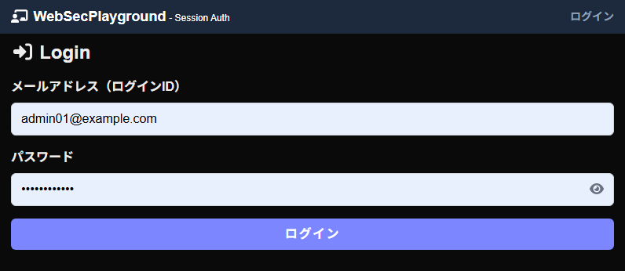
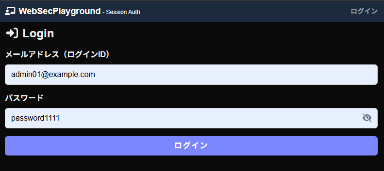
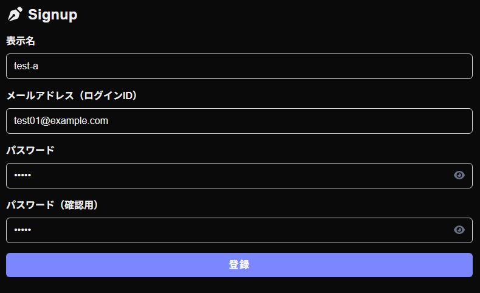
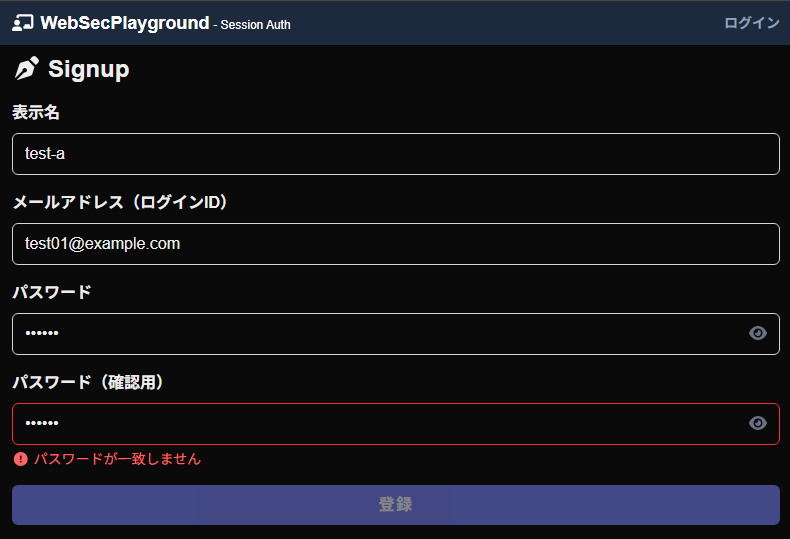
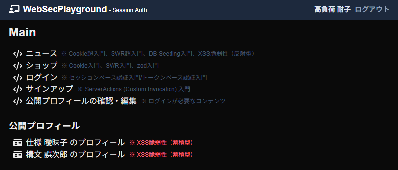

# Web Security Playground 2 - 認証・認可機能の実装

## 概要
本プロジェクトは、Next.jsを用いてセキュアな認証・認可機能を実装したウェブアプリケーションです。
提供された教材（web-sec-playground-2）をベースに、要件に従って「セッションベース認証」を採用し、安全な認証システムの構築を行いました。

## 実装した追加機能
本課題の要件である「教材には実装されていない認証・認可に関する機能」として、UI/UXの向上と入力ミスの防止を目的とした以下の2機能を実装しています。

### 1. パスワードの表示・非表示切り替え機能
- **実装箇所:** ログイン画面 (`/login`) および サインアップ画面 (`/signup`)
- **詳細:** パスワード入力欄にトグルボタン（👁️アイコン）を配置し、Reactのステートを用いて `<input>` の `type` 属性を `password` と `text` で動的に切り替える処理を実装しました。これにより、ユーザが自身の入力内容を安全に視認・確認できるようになります。

### 2. サインアップ時の確認用パスワード要求機能
- **実装箇所:** サインアップ画面 (`/signup`) および バリデーションスキーマ (`SignupRequest.ts`)
- **詳細:** アカウントの新規登録時におけるパスワード設定の確実性を高めるため、「確認用パスワード」の入力フィールドを追加しました。Zodの `.refine()` メソッドを用いて、フロントエンドでのリアルタイムな入力チェックと、バックエンドでのリクエスト検証の双方で「2つのパスワードの完全一致」を保証する堅牢なバリデーションを実装しています。

## セキュリティ要件への対応と工夫点
セキュアなシステム設計の観点から、ベースとなるコードに対して以下の改修および最適化を行いました。

- **パスワードの不可逆暗号化:** 平文でのパスワード保存を排除し、`bcryptjs` を用いたハッシュ化（Cost factor: 10）を実装しました。登録時および初期データ投入時（`seed.ts`）にハッシュ化を行い、認証時には `bcrypt.compare` を用いて安全な照合を行っています。
- **アタックサーフェス（攻撃対象領域）の最小化:** セッションベース認証へ一本化するにあたり、不要となったJWT（トークンベース認証）関連の処理を完全に削除しました。さらに、本課題の主目的である認証機能に関係のない「ニュース機能」および「ショップ機能」に関するAPIルート、コンポーネント、データベーススキーマを全て削除し、脆弱性の温床となり得る不要なコードを排除してシステムの保守性と安全性を高めています。

## 動作確認（スクリーンショット）

1. **ログイン画面（初期状態）**
   

2. **ログイン画面（パスワード表示機能の動作確認）**
   

3. **サインアップ画面（確認用パスワード欄の追加）**
   

4. **サインアップ画面（パスワード不一致バリデーションエラーの確認）**
   

5. **ログイン後の画面（認証成功の確認）**
   